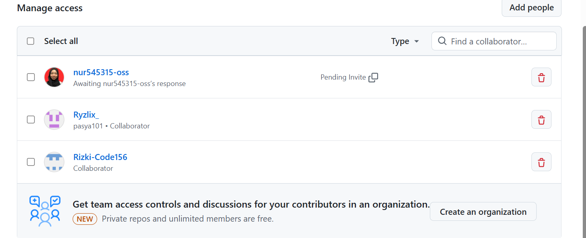

### Proses Pengembangan Project Lab Kelompok 4 ###
Anggota Kelompok 4 :
1. Ibrahim Hilal 2488010030
2. Rizki Aidil Fazri_2488010021
3. Pasya Nur Rizki_2488010052
4. Nur Khotimah 2488010017

# Progres Pengembangan 1(Pertemuan 5)#
1. Tugas Ketua Kelompok(Hilal)
    -Inisiasi Project dan invite Member
    
    - Create Project (npx create-expo-app@latest)
    <video controls src="Recording-2026-10-01-095159.mp4" title="Title"></video>
2. Tugas Anggota Kelompok
    - Accept Member
    Nama: Rizki Aidil Fazri
    
    Nama: Nurkhotimah
    
    - Clone Project
